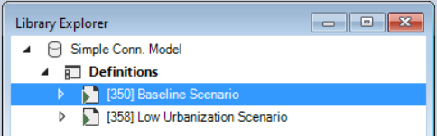
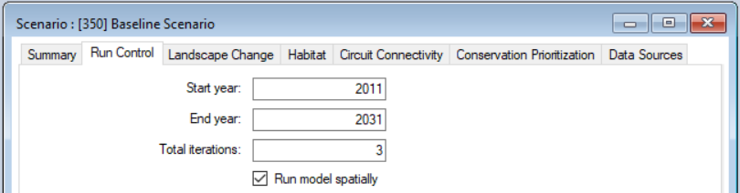
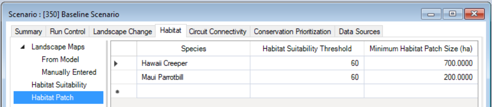

# Getting started with **ST-Connect**

## Quickstart Tutorial

This quickstart tutorial will introduce you to basics of working with ST-Connect. The steps include:
 
* Installing ST-Connect
* Creating a new ST-Connect Library
* Configuring the ST-Connect Library
* Viewing model inputs
* Running the model (coming soon)
* Analyzing the results (coming soon)

## **Step 1: Install ST-Connect**
**ST-Connect** is a Package within the [SyncroSim](https://syncrosim.com/){:target="_blank"} simulation modeling framework; as such, running **ST-Connect** requires that the **SyncroSim** software be installed on your computer. To install **ST-Connect**, follow the instructions under [How to Install](https://apexrms.github.io/stconnect/){:target="_blank"}.

## **Step 2: Create a new ST-Connect Library**
Having installed the **ST-Connect** Package, you are now ready to create your first SyncroSim Library. A Library is a file (with extension *.ssim*) that contains all of your model inputs and outputs. Note that the format of each Library is specific to the Package for which it was initially created. To create a new Library, choose **New Library...** from the **File** menu.
 

 
In this window:
 
* Select the row for the ***stconnect - Connectivity planning for future climate and land-use change***. Note that as you select a row, the list of **Templates** available and suggested **File name** for that base package are updated.
* Select the ***Simple Conn. Model*** Template as shown above.
* Optionally type in a new **File name** for the Library (or accept the default); you can also change the **Folder** containing the file using the **Browse...** button.
 
When you are ready to create the Library file, click **OK**. A new Library will be created and loaded into the Library Explorer.

## **Step 3: Configure library settings*
•	In order for the model to run, SyncroSim needs to locate the locations of your R, Julia, and Zonation (if applicable) executables. The default file location of the Julia executable is blank. Select the Folder icon, navigate to the proper location on your local computer, then click Open.

## **Step 4: Review the model inputs**
The contents of your newly created Library are now displayed in the Library Explorer. Model inputs in SyncroSim are organized into Scenarios, where each Scenario consists of a suite of values, one for each of the Model's required inputs.

> **Note:**
> Because you chose the ***Simple Conn. Model*** Template when you created your Library, your Library already contains two pre-configured Scenarios with model inputs. These inputs were filled in and distributed as a sample with the package to help you get started quickly, and represent hypothetical management Scenarios: one a Baseline Scenario, and another Low Urbanization Scenario.

 
As shown in the image above, the Library you have just opened contains two Scenarios, each with a unique ID. The first of these scenarios (with ID=350, as shown above in square brackets) is named ***Baseline Scenario***; this scenario contains a suite of model inputs corresponding to a hypothetical baseline harvest plan. The second scenario (with ID=358 and named ***Low Urbanization Scenario***) contains model inputs corresponding to an alternative plan where urbanization targets are 4 times less than those of the Baseline Scenario.
 
To view the details of the first of these Scenarios:
 
* Select the scenario named ***Baseline Scenario*** in the Library Explorer.
* Right-click and choose **Properties** from the context menu to view the details of the Scenario.

This opens the Scenario Properties window.
 

 
The first tab in this window, called **Summary**, displays some generic information for the Scenario. The second tab, **Run Control**, contains parameters for running a model simulation. In this example, the Scenario will run for 20 years, starting in the year 2011, and repeated for 3 Monte Carlo iterations. By default the **Habitat**, **Circuit Connectivity**, and **Conservation Prioritization** analyses are run every 10 years.
 

 
Click on the **Landscape Change**, **Habitat**, **Circuit Connectivity**, and **Conservation Prioritization** tabs to familiarize yourself with this Scenario's inputs.
 

 
