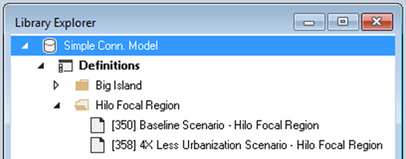
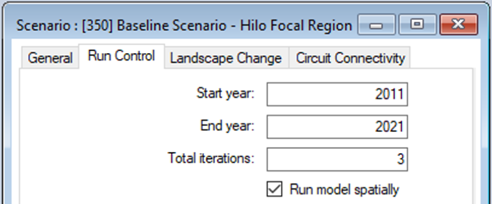
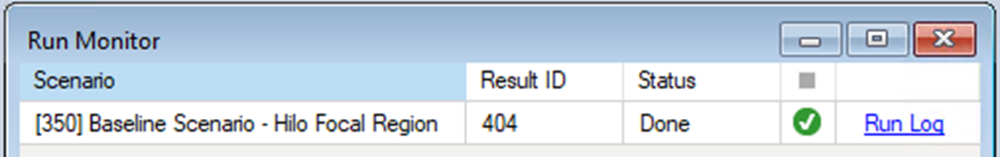
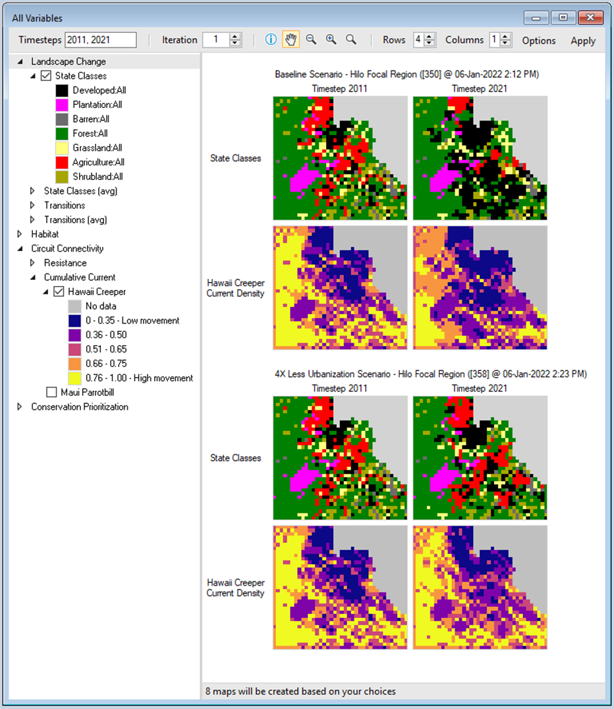

# Getting started with **ST-Connect**

## Quickstart Tutorial

This quickstart tutorial will introduce you to the basics of working with ST-Connect. The steps include:
 
* Installing ST-Connect
* Creating a new ST-Connect Library
* Configuring the ST-Connect Library
* Viewing model inputs
* Running the model
* Analyzing the results

## **Step 1: Install ST-Connect**
**ST-Connect** is a Package within the [SyncroSim](https://syncrosim.com/){:target="_blank"} simulation modeling framework; as such, running **ST-Connect** requires that the **SyncroSim** software be installed on your computer. Download the latest version of **SyncroSim** [here](https://syncrosim.com/download/){:target="_blank"}. **ST-Connect** also requires R [version 4.0.4](https://www.r-project.org/){:target="_blank"} or higher and [Circuitscape 5](https://circuitscape.org/downloads/){:target="_blank"}. If you wish to include Conservation Prioritization in your pipeline, download and install Zonation [version 4.0.0](https://github.com/cbig/zonation-core/releases){:target="_blank"}.
> **Note:** When installing Circuitscape, follow the Circuitscape.jl installation link and not the link to the Windows executable.

Once all required programs are installed, open **SyncroSim** and select **File -> Packages... -> Install...**, then select the **ST-Connect** package and click OK. Alternatively, download the [latest release](https://github.com/ApexRMS/stconnect/releases/){:target="_blank"} from GitHub. Open **SyncroSim** and select **File -> Packages... -> Install From File...**, then navigate to the downloaded package file with the extension *.ssimpkg*.

## **Step 2: Create a new ST-Connect Library**
Having installed the **ST-Connect** Package, you are now ready to create your first SyncroSim Library. A Library is a file (with extension *.ssim*) that contains all of your model inputs and outputs. Note that the format of each Library is specific to the Package for which it was initially created. To create a new Library, choose **New Library...** from the **File** menu.
 

 
In this window:
 
* Select the row for ***stconnect - Connectivity planning for future climate and land-use change***. Note that as you select a row, the list of **Templates** available and suggested **File name** for that base package are updated.
* Select the ***Simple Conn. Model*** Template as shown above.
* Optionally type in a new **File name** for the Library (or accept the default); you can also change the target **Folder** using the **Browse...** button.
> **Note:** If you intend on using Multiprocessing (recommended), ensure your SyncroSim Library is saved to the C: Drive. Saving your library to OneDrive will result in an error when completing a model run.

When you are ready to create the Library file, click **OK**. A new Library will be created and loaded into the Library Explorer.

## **Step 3: Configure library settings**
For the model to run, SyncroSim needs to locate the locations of your R, Julia, and Zonation (if applicable) executables. The R executable will be found automatically. To check, double-click on **Simple Conn. Model** and navigate to the **Options** tab. In the **R Configuration** datasheet, you should see the file path to your R executable. If not, click **Browse...** and navigate to the correct file location. The default file location of the Julia executable is blank. Select the Folder icon, navigate to the proper location on your local computer (example shown below), then click **Open**.
 

 
> **Note:** As shown, the AppData folder will need to be accessed. This is normally a hidden folder on your computer. To access this folder, open your Windows Explorer, open the View tab, and enable Hidden Items.

## **Step 4: Review the model inputs**
The contents of your newly created Library are now displayed in the Library Explorer. Model inputs in SyncroSim are organized into Scenarios, where each Scenario consists of a suite of values, one for each of the Model's required inputs.

Because you chose the ***Simple Conn. Model*** Template when you created your Library, your Library already contains two folders, each with two pre-configured Scenarios with model inputs derived from historical land change data. These inputs were filled in and distributed as a sample with the package to help you get started quickly, and represent hypothetical management scenarios. The Scenarios named ***4X Less Urbanization Scenario*** contain model inputs corresponding to an alternative land management plan where urbanization targets are 4 times less than in the ***Baseline Scenario***. 

It is recommended that you follow the quickstart tutorial using the **Hilo Focal Region** Scenarios (with IDs=350 and 358, as shown below in square brackets). These Scenarios use cropped landscapes of the **Big Island** Scenarios. As such, it will take a significantly shorter amount of time to complete a run. Explore the **Big Island** Scenarios afterwards if desired.

 

To view the details of the first of these Scenarios:
 
* Select the scenario named ***Baseline Scenario - Hilo Focal Region*** in the Library Explorer.
* Right-click and choose **Properties** from the context menu to view the details of the Scenario.

This opens the Scenario Properties window.
 

 
The first tab in this window, called **General**, contains three datasheets. The first, **Summary**, displays some general information for the Scenario. The second, **Pipeline**, allows the user to select the run order of the inputs in the model. Finally, the **Datafeeds** datasheet displays a list of all data sources inputted into the model.
 

 
The second tab in the window, **Run Control**, contains parameters for running a model simulation. In this example, the Scenario will run for 10 years, starting in the year 2011, and is repeated for 3 Monte Carlo iterations. By default the **Landscape Change** and **Circuit Connectivity** analyses are run every 10 years.
 

 
Click on the **Landscape Change** and **Circuit Connectivity** tabs to familiarize yourself with this Scenario's inputs. Notice that, in the ***Baseline Scenario***, Urbanization has a target area of 12 to 32 square kilometres.
 

 
Next, open the Scenario Properties window for the scenario named ***4X Less Urbanization Scenario - Hilo Focal Region***. Notice that the target minimum and maximum within the Urbanization transition type have decreased relative to the ***Baseline Scenario***.
 

 

## **Step 5: Run the model**
 In the toolbar, enable **Multiprocessing** with 3 jobs. This will cut down the time required to run the simulation (~8 minutes when **Multiprocessing** is enabled, ~24 minutes when is disabled). 
  

 Right-click on the ***Baseline Scenario - Hilo Focal Region*** in the **Scenario Manager** window and select **Run** from the context menu. If prompted to save your project, click **Yes**. If the run is successful, you will see a Status of **Done** in the **Run Monitor** window, at which point you can close the **Run Monitor** window; otherwise, click on the **Run Log** link to see a report of any problems. Make any necessary changes to your Scenario, then re-run the Scenario.
 

 
Run ***4X Less Urbanization Scenario - Hilo Focal Region*** next by repeating the steps above.

## **Step 6: Analyze the results**
To view results from your run, move to the **Charts** tab at the bottom left of the **Scenario Manager** screen and double-click on **Summary** to open it.
 

 
You can now view and compare the results of running your two Scenarios through the model from the ST-Connect Package.
 

 
Next, select the **Maps** tab from the bottom of the **Scenario Manager** window (i.e. beside the **Charts** tab). Double click on **All Variables**. The mapping window should display changes in state class and circuit connectivity by default. In the state class maps, the ***Baseline Scenario*** results in a more drastic increase in developed land than the **4X Less Urbanization Scenario**. Likewise, the **Baseline Scenario** results in less movement across the landscape by 2021, compared to the **4X Less Urbanization Scenario**.
 
> **Note:** Legends can be customized by double-clicking on the bins.

 
Scenarios featuring the entirety of Hawaii's Big Island are included in the Library. Follow Steps 4 and 5 to explore these scenarios. Notice that these scenarios run from 2011 to 2051. Expect the model run to take about 1.5 hours per scenario.
 

 
> **Note:**
> You can add and remove Results Scenarios from the list of scenarios being analyzed by selecting a Scenario in the Library Explorer and then choosing either **Add to Results** or **Remove from Results** from the Scenario menu. **Scenarios** currently selected for analysis are highlighted in **bold** in the Library Explorer. When adding or removing results from the Scenario menu, make sure to click on "Full Zoom", in the mapping window, after the desired scenarios are selected.
