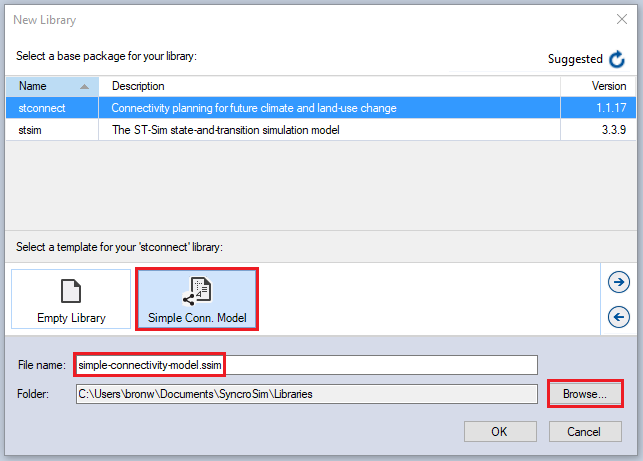
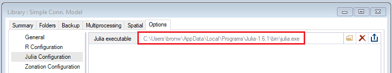
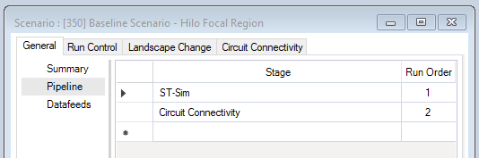
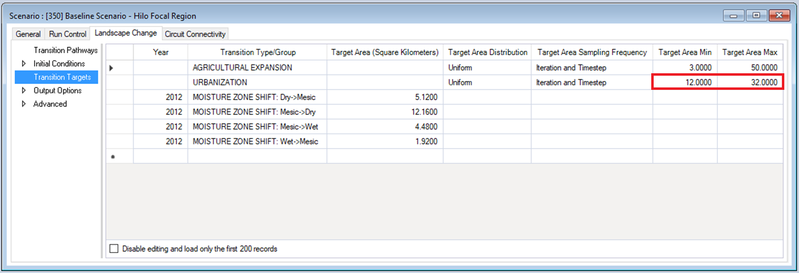
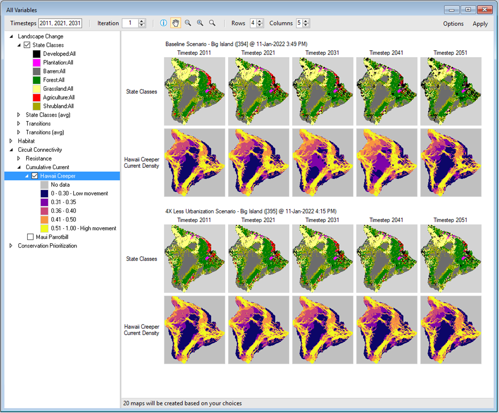

# Getting started with **ST-Connect**

## Quickstart Tutorial

This quickstart tutorial will introduce you to the basics of working with ST-Connect. The steps include:
* Installing ST-Connect
* Creating a new ST-Connect Library
* Configuring the ST-Connect Library
* Viewing model inputs
* Running the model
* Analyzing the results

 

## **Step 1: Installing ST-Connect**

**ST-Connect** is a Package within the [SyncroSim](https://syncrosim.com/){:target="_blank"} simulation modeling framework. As such, running **ST-Connect** requires that the **SyncroSim** software be installed on your computer. Download the latest version of **SyncroSim** [here](https://syncrosim.com/download/){:target="_blank"}.

**ST-Connect** also requires R [version 4.0.4](https://www.r-project.org/){:target="_blank"} or higher, and [Circuitscape 5](https://circuitscape.org/downloads/){:target="_blank"}. If you wish to include Conservation Prioritization in your pipeline, download and install Zonation [version 4.0.0](https://github.com/cbig/zonation-core/releases){:target="_blank"}.

> **Note:** To download and install Circuitscape, follow the Circuitscape.jl installation link and not the link to the Windows executable. It will prompt you to install Julia first, which will then be used to install Circuitscape.

Once all required programs are installed, open **SyncroSim** and select **File -> Packages... -> Install...**, check the box for the **stconnect** package and click OK.

 

## **Step 2: Creating a new ST-Connect Library**

Having installed the **ST-Connect** Package, you are now ready to create your first SyncroSim [Library](https://docs.syncrosim.com/how_to_guides/library_overview.html){:target="_blank"}. A Library is a file (with extension *.ssim*) that contains all of your model inputs and outputs. To create a new Library, choose **New Library...** from the **File** menu.

* Select the row for ***stconnect - Connectivity planning for future climate and land-use change***. Note that as you select a row, the list of **Templates** available and suggested **File name** for that base package are updated.
* Select the ***Simple Conn. Model*** Template.
* Type in a new **File name** for the Library or accept the default. You can also change the target **Folder** using the **Browse...** button.

> **Note:** If you intend on using Multiprocessing (recommended), ensure your SyncroSim Library is saved to the C: Drive. Saving your library to OneDrive will result in an error when completing a model run.

When you are ready to create the Library file, click **OK**. A new Library will be created and loaded into the Library Explorer.

 

## **Step 3: Configuring the ST-Connect Library**

For the model to run, SyncroSim needs to locate your R, Julia, and Zonation (if applicable) executables. 

The R executable will be found automatically. To check, in the Library Explorer, double-click on hte Library **Simple Conn. Model** and navigate to the **Options** tab. In the **R Configuration** datasheet, you should see the file path to your R executable. If not, click **Browse...** and navigate to the correct file location.

The default file location of the Julia executable is blank. Select the Folder icon, navigate to the proper location on your local computer (example shown below), then click **Open**.

> **Note:** As shown below, the AppData folder will need to be accessed. This is normally a hidden folder on your computer. To access this folder, open your Windows Explorer, open the View tab, and enable Hidden Items.

 

## **Step 4: Viewing model inputs**

The contents of your newly created Library are now displayed in the Library Explorer. Model inputs in SyncroSim are organized into Scenarios, where each Scenario consists of a suite of values, one for each of the model's required inputs.

Because you chose the ***Simple Conn. Model*** Template when you created your Library, your Library already contains two Project folders (***Big Island*** and ***Hilo Focal Region***), each with two pre-configured Scenarios with model inputs derived from historical land change data. These inputs were filled in and distributed as a sample with the package to help you get started quickly, and represent hypothetical management scenarios. The Scenarios named ***4X Less Urbanization Scenario*** contain model inputs corresponding to an alternative land management plan where urbanization targets are 4 times less than in the ***Baseline Scenario***.

For the purposes of this Quickstart tutorial, you will run the **Hilo Focal Region** Project, with Scenarios IDs 350 and 358 (IDs shown below in square brackets). These Scenarios use cropped landscapes of the **Big Island** Scenarios and will take a significantly shorter amount of time to run. Explore the **Big Island** Scenarios afterwards if desired.

To view the details of the first of these Scenarios:
* Select the scenario named ***Baseline Scenario - Hilo Focal Region*** in the Library Explorer.
* Double-click, or right-click and choose **Properties** from the context menu to view the details of the Scenario.

This opens the Scenario Properties window:

The first tab in this window, called **General**, contains three datasheets. The first, **Summary**, displays some general information for the Scenario. The second, **Pipeline**, allows the user to select the run order of the **Stages** in the pipeline.

Finally, the **Datafeeds** datasheet displays a list of all data sources input into the model.

The second tab in the window, **Run Control**, contains parameters for running the model simulation. In this example, the Scenario will run for 10 years, starting in the year 2011, and is repeated for 3 Monte Carlo iterations.

Click on the **Landscape Change** and **Circuit Connectivity** tabs to familiarize yourself with this Scenario's inputs. In particular, under **Landscape Change > Output Options > Output Options Spatial** and **Circuit Connectivity > Output Options**, note that the output frequency is set to 10 years in order to speed up the run times and save on disk space. Also notice that, under **Landscape Change > Transition Targets**, the ***Baseline Scenario*** has a Urbanization target area of 12 to 32 sq. km.

Next, open the Scenario Properties window for the scenario named ***4X Less Urbanization Scenario - Hilo Focal Region***. Notice that the target minimum and maximum within the Urbanization transition type have decreased relative to the ***Baseline Scenario***.

 

## **Step 5: Running the model**

In the toolbar, enable **Multiprocessing** with 3 jobs. This will cut down the time required to run the simulation (~8 minutes when **Multiprocessing** is enabled, ~24 minutes when is disabled).

Right-click on the ***Baseline Scenario - Hilo Focal Region*** in the **Scenario Manager** window and select **Run** from the context menu. If prompted to save your project, click **Yes**. If the run is successful, you will see a Status of **Done** in the **Run Monitor** window, at which point you can close the **Run Monitor** window; otherwise, click on the **Run Log** link to see a report of any problems, make any necessary changes to your Scenario, then re-run the Scenario.

Run ***4X Less Urbanization Scenario - Hilo Focal Region*** next by repeating the steps above.

 

## **Step 6: Analyzing the results**

To view results from your run, move to the **Charts** tab at the bottom left of the **Scenario Manager** screen and double-click on **Summary** to open it.

You can now view and compare the results of running your two Scenarios through the model from the ST-Connect Package.

Next, select the **Maps** tab from the bottom of the **Scenario Manager** window (*i.e.*, beside the **Charts** tab). Double click on **All Variables**. The mapping window should display changes in state class and circuit connectivity by default. In the state class maps, the ***Baseline Scenario*** results in a more drastic increase in developed land than the **4X Less Urbanization Scenario**. As a consequence, the **Baseline Scenario** results in less movement across the landscape by 2021, compared to the **4X Less Urbanization Scenario**.

> **Note:** Legends can be customized by double-clicking on the bins.

Scenarios featuring the entirety of Hawaii's Big Island are included in the Library. Follow Steps 4 and 5 to explore these scenarios. Notice that these scenarios run from 2011 to 2051. Expect the model run to take about 1.5 hours per scenario.

> **Note:** You can add and remove Results Scenarios from the list of scenarios being analyzed by selecting a Scenario in the Library Explorer and then choosing either **Add to Results** or **Remove from Results** from the Scenario menu. **Scenarios** currently selected for analysis are highlighted in **bold** in the Library Explorer. When adding or removing results from the Scenario menu, make sure to click on "Full Zoom", in the mapping window, after the desired scenarios are selected.

 

## **Learn more**

* For an example of an application of ST-Connect, see [this study](https://quebio.ca/en/connectivity_report){:target="_blank"}.
* For more on Circuitscape, see the [Circuitscape documentation](https://docs.circuitscape.org/Circuitscape.jl/latest/){:target="_blank"}.
* For more on connectivity forecasting research, see the special issue [Dynamic Landscape Connectivity](https://www.mdpi.com/journal/land/special_issues/landscape_connectivity){:target="_blank"}.
