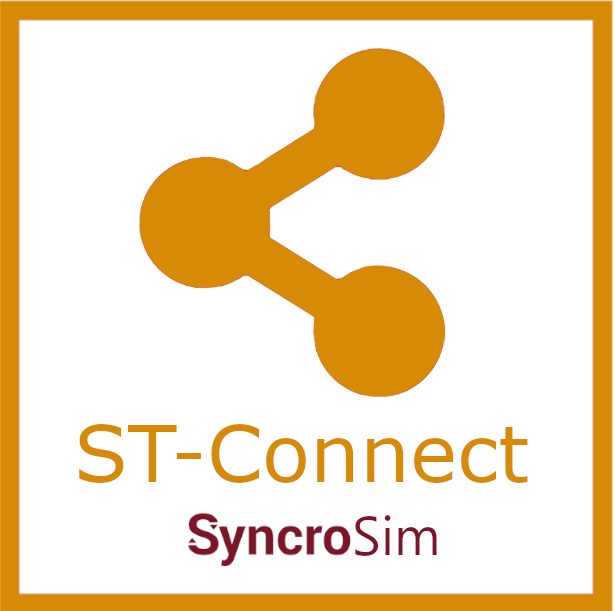
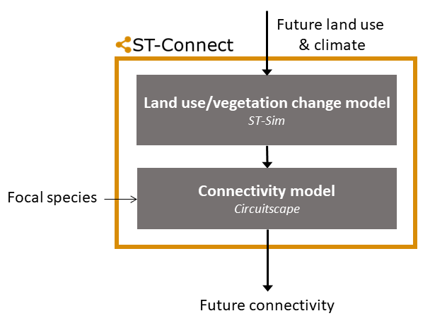

# **ST-Connect** SyncroSim Package

    <a href="https://github.com/ApexRMS/stconnect">
 
## Connectivity planning for future climate and land-use change
### *ST-Connect* is an open-source [SyncroSim](https://syncrosim.com/download/){:target="_blank"} Base Package for forecasting landscape connectivity.

**ST-Connect** uses a pipeline approach to chain together spatially-explicit models of landscape change and habitat connectivity. A simple **ST-Connect** model consists of two components. [ST-Sim](http://docs.stsim.net/){:target="_blank"} forecasts landscape dynamics, projecting changes in both vegetation and land use. [Circuitscape](https://circuitscape.org/){:target="_blank"} predicts connectivity in heterogenous landscapes, using algorithms from electronic circuit theory.
 

 
**ST-Connect**'s accessible framework has helped support natural resource management projects such as a conservation prioritization project focusing on key wildlife species in Quebec [(Rayfield, Larocque, Martins et al., 2021)](https://quebio.ca/en/connectivity_report){:target="_blank"}. **ST-Connect** is a package that plugs into the [SyncroSim](https://syncrosim.com/){:target="_blank"} modeling framework. It can also be run from the R programming language using the [rsyncrosim](https://syncrosim.com/r-package/){:target="_blank"} R package and from the Python programming language using the [pysyncrosim](https://pysyncrosim.readthedocs.io/en/latest/){:target="_blank"} Python package.

## Requirements

This package requires the following software: 
The <a href="https://syncrosim.com/download/" target="_blank">latest version</a> of Syncrosim.
 
R [version 4.0.4](https://www.r-project.org/){:target="_blank"} or higher.
 
[Circuitscape 5](https://circuitscape.org/downloads/){:target="_blank"}.
 
Zonation [version 4.0.0](https://github.com/cbig/zonation-core/releases){:target="_blank"} (optional).

## How to Install

For installation instructions, see the **Install ST-Connect** section on the [Getting Started](https://apexrms.github.io/stconnect/getting_started.html) page.

## Getting Started

For more information on **ST-Connect**, including a Quickstart Tutorial, see the [Getting Started](https://apexrms.github.io/stconnect/getting_started.html) page.

## Links

Browse source code at
[http://github.com/ApexRMS/stconnect/](http://github.com/ApexRMS/stconnect/){:target="_blank"}
 
Report a bug at
[http://github.com/ApexRMS/stconnect/issues](http://github.com/ApexRMS/stconnect/issues){:target="_blank"}

## Developers

Bronwyn Rayfield (Author, maintainer) 
 
Alex Embrey (Author)
 
Colin Daniel (Author)
 
Valentin Lucet (Author)
 
Andrew Gonzalez (Author) 
 
Kyle Martins (Author)
